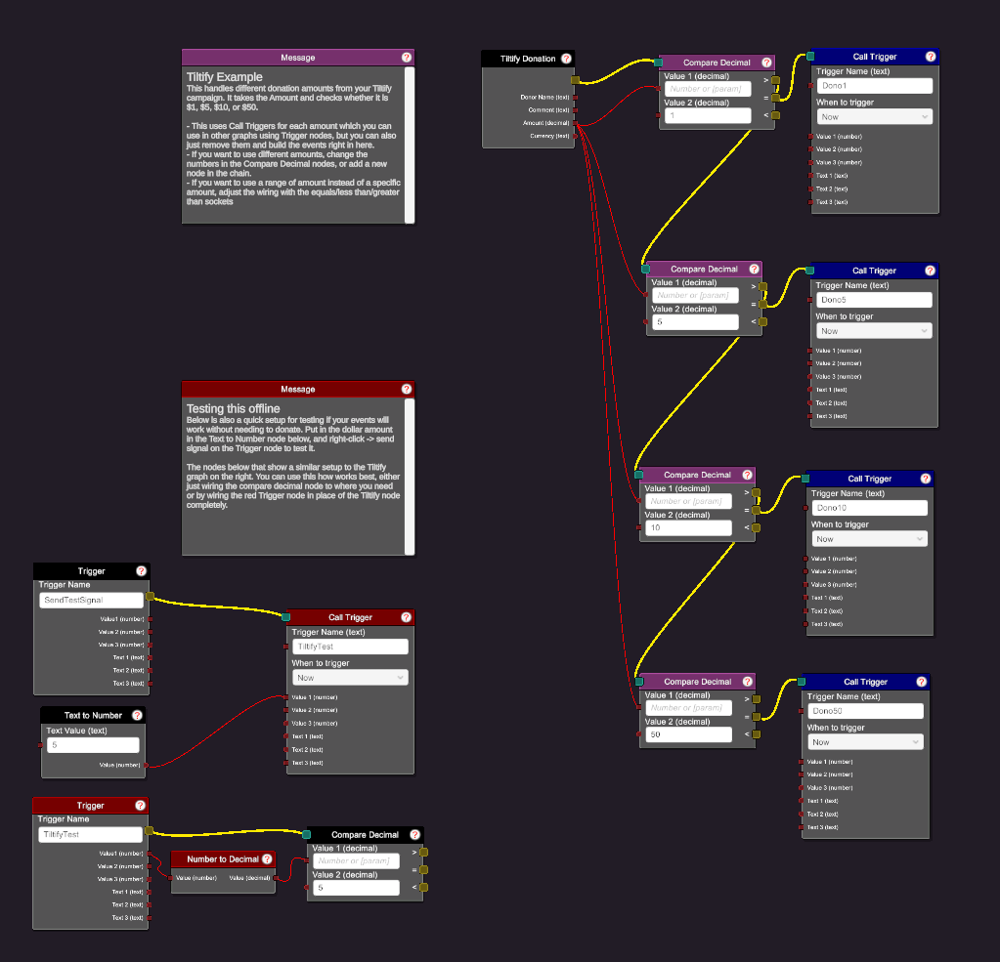

# Tiltify Nodes Example
This handles different donation amounts from your Tiltify campaign. It takes the Amount and checks whether it is $1, $5, $10, or $50. 
- This uses Call Triggers for each amount which you can use in other graphs using Trigger nodes, but you can also just remove them and build the events right in here.
- If you want to use different amounts, change the numbers in the Compare Decimal nodes, or add a new node in the chain.

If you want to use a range of amount instead of a specific amount, adjust the wiring with the equals/less than/greater than sockets

