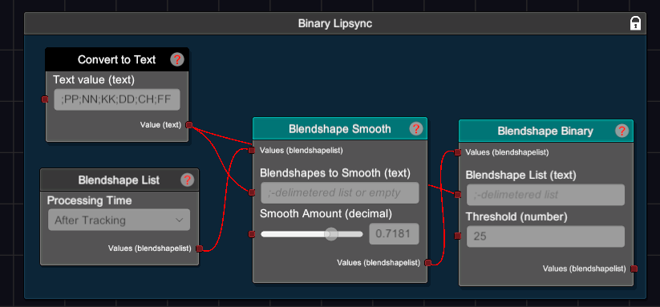

# 2D Lipsync
Simple blendshape pipeline setup for having binary lipsync. Will make so that only one lipsync blendshape can be active at a time.



You can use the smooth node to tune the jitteriness. Could even split between different sets of the visemes if you need (like put more smoothing on A;O than I).

## Instructions
Copy the codeblock below or in the text file and import it a graph
```
VNYANGRAPH:VkYeQmluYXJ5IExpcHN5bmMeMR43Hi02ODcfMjEeNzc3HzM1ORxCWB5PbkJsZW5kc2hhcGVMaXN0HlZGHjceLTU2Nx8tMjM0HnN0YWdlHzAdRmQeQmxlbmRzaGFwZUJpbmFyeR5WRh41Hi0zNR8tMjE2HmJzHx90aB8yNR1qaR5CbGVuZHNoYXBlU21vb3RoHlZGHjUeLTI5Mh8tMjEzHmJzHx9zbW9vdGgfMC43MTgxODE4HWcyHkNvbnZlcnRUb1RleHQeVkYeNh4tNTcwHy04Mh5wYXJhbU5hbWUfQTtFO0k7TztVO1NTO1RIO1JSO1BQO05OO0tLO0REO0NIO0ZGHB1qaTAfQlgwHkZkMB9qaTAeamkxH2cyMB5GZDEfZzIw
```

Related VNyan Discord thread: https://discord.com/channels/714814460010823690/1430725373724983357