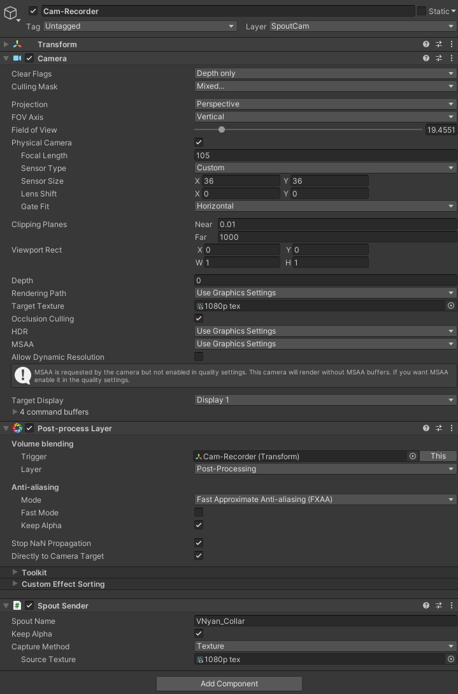

# How to set up more Camera's with Spout2 senders
You can have multiple different camera's set up in VNyan that can output to different spout2 captures. These can be recorded in OBS at the same time :3 You can also hide or show different layers in VNyan from being VNyan, like if you wanted a camera that didn't show any props or other effects.

It does increase performance by a bit (you end up rendering many things twice) so you'll have to be careful how you use this, but here's how to do it (I'll also leave some camera props to try too).

Relevant VNyan Discord thread: https://discord.com/channels/714814460010823690/1350160498980814960

## Instructions
You're just going to make a VNyan Prop with a Unity Camera and Spout Sender in Unity. You'll need the [KlakSpout](<https://github.com/keijiro/KlakSpout>) plugin and VNyan SDK (and make sure you have Unity's Post Processing package active).
1. Create a new render texture in your project files (under Create > Render Texture).
  - Set the Render Texture size to whatever resolution you want (ie 1920x1080)
  -  Set Anti-aliasing to `None`, and Color Format to `R32G32B32A32_SFLOAT`
2. Create a new Camera in your scene 
  - Set Clear Flags  to `Solid Color`
  - Set Background Color to black with 0 alpha
  - Set what you want your Field of View to be, or click `Physical Camera` to adjust it further (if you want to match the Focal Length setting in VNyan you can set that here)
  - Set Clipping Planes Near to a smaller number to avoid model clipping
  - Set Target Texture to your Render Texture you created.
3. Add a Post-Processing Layer component to the camera
  - Set your Anti-Aliasing mode
  - Set the Layer to Post-Processing/layer 8 (you might need to set this up, see below)
4. Add a Spout Sender component to the camera
  - Set Capture Method to `Texture`, and Source Texture to the same Render Texture as before.
5. Export the camera object as a VNyan prop or custom object

That's mainly it! Once you bring this into VNyan and it's visible, you should see the name that you gave the camera under your Spout2 sources. If you're using it as a prop, you can set it to link to anything you want, or directly to the VNyan built-in camera if you want it to have the same view as your in-vnyan cam.

If you want to control something like focal length you can set up an animation and control it with a parameter. Use the VNyan Anim Param Link to control it from within VNyan :3



### Rendering Layers and Culling Mask
By default the camera's Culling Mask setting will be `Everything`, but you can change this to choose which layers you want to be rendered in the camera. If you click the Layer dropdown near the top right of the Inspector tab, you will see all the named/setup layers, and `add layer` at the bottom to setup new layers. VNyan internally is already using many of these layers for rendering post-processing effects, droppables, props, etc. You can set up these layers in Unity here, then use the Culling Mask setting to choose which layers you want to be shown in the camera.

I don't know what *all* of the rendering layers in VNyan are, but here are the ones that I know about that Suvi shared at some point:
```
- 0 = Default (likely has your model)
- 1 = TransparentFX
- 2 = Ignore Raycast
- 4 = Water
- 5 = UI
- 8 = Post-Processing
- 9 = Throwable
- 10 = Droppable
- 11 = Ground
- 12 = Ragdoll
- 13 = Edible
- 14 = Mouth
- 15 = AvatarColliders
- 16 = World
- 17 = Prop
- 18 = OnlyAvatar
- 19 = Custom Object
- 20 = TransformGizmo
- 21 = Bubble
- 22 = Hidden on Main Camera
- 23 = Sticker
```

### Camera props to try
I'll leave 2 different camera props to try out if you want. One of them you can control the Focal length by setting a parameter (there's an accompanying graph to use)
- 1080p camera (controllable focal length, SMAA)
- 1080p camera only with layers 0, 8, 17 & 19 (105 focal length, SMAA)