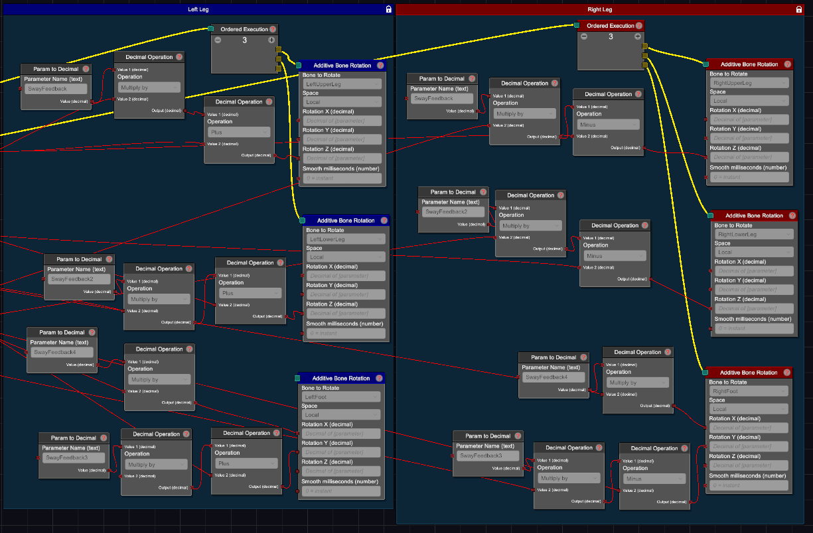

# Leg Sway Graph
This is a standalone setup to give your model's legs sway movement, like the arm sway graphs, using pendulum chains.

You can change the amount of overall sway in the upper leg, lower leg and foot to the right.

There's also an extra wobble present. If you don't like the wobble, or want to tweak the amount of wobble, you can use the WobbleLegMult parameter to the right to control the scale of the whole wobble effect, or change the scale of the "SwayFeedback" outputs in the wobble pendulum settings.

## Installation
- Add both pendulum chains and the graph

